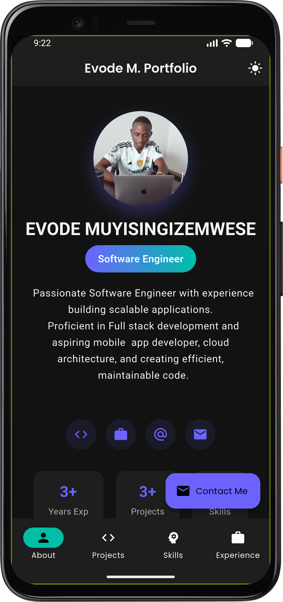
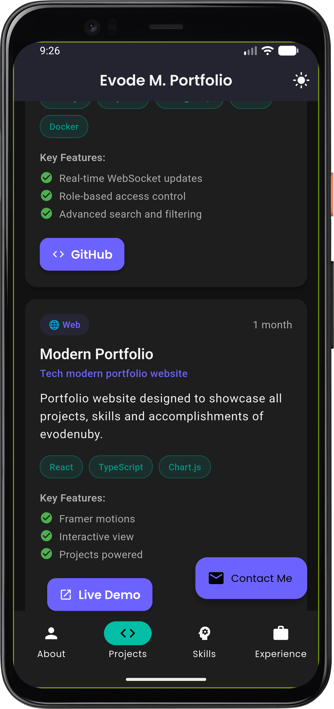
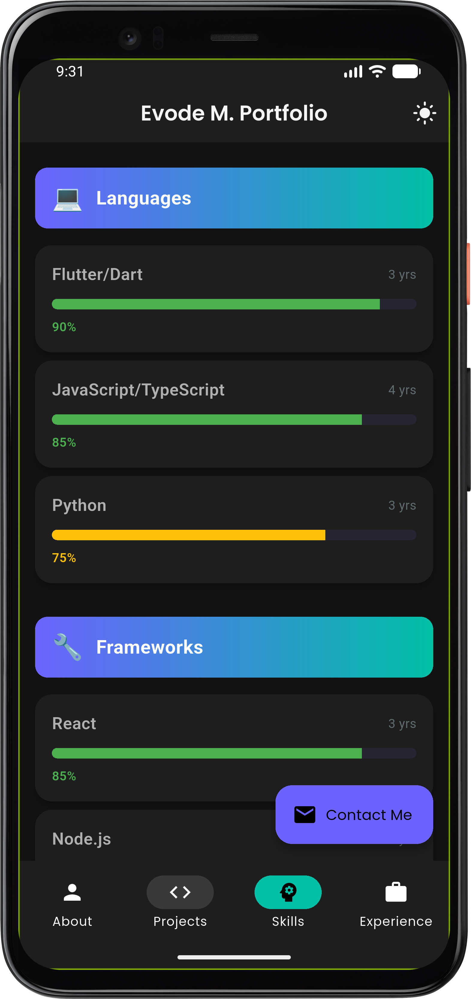
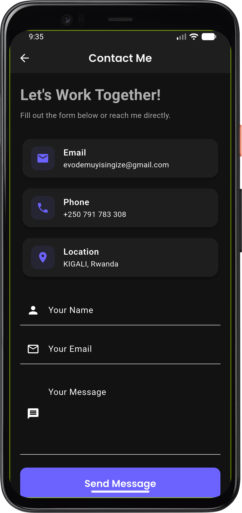
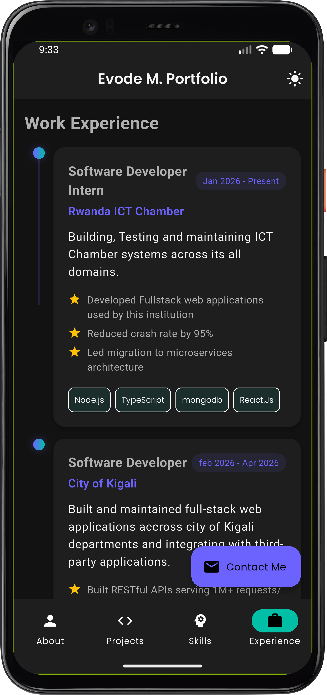

# Evode Mobile Portfolio App

---

## 🎬 App Demo

---

## 📥 Download App

---

##  Screenshots

### ✨ App Preview

<table>
  <tr>
    <td align="center">
       
      <b>Home Screen</b>
    </td>
    <td align="center">
       
      <b>Projects</b>
    </td>
  </tr>

  <tr>
    <td align="center">
       
      <b>Skills</b>
    </td>
    <td align="center">
       
      <b>Contact</b>
    </td>
  </tr>

  <tr>
    <td colspan="2" align="center">
       
      <b>Experience</b>
    </td>
  </tr>
</table>

## ✨ Features
- Modern UI/UX
- Clean Portfolio Design
- Smooth Animations
- Project Showcase
- Skills Overview
- Contact Integration
- Download CV Support

## 🧊 UI Concept

> The app is designed with a **minimal glass-like modern UI approach**, focusing on:
- Clean spacing
- Responsive layouts
- Soft shadows
- Mobile-first experience

## 🛠 Tech Stack
- Flutter
- Dart
- Material Design

---

## 📥 Releases

Check the latest stable build in the GitHub Releases section.